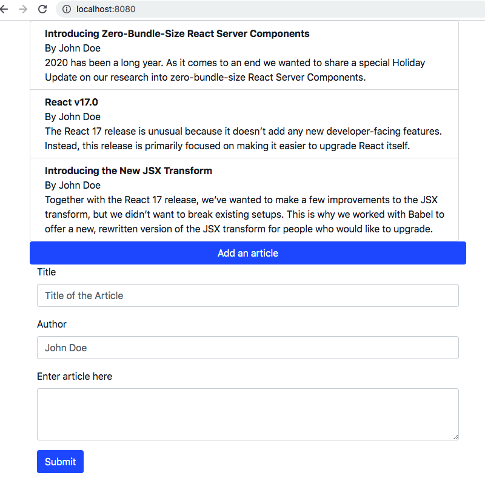

# blog-like

Simple blog-like wesite
## Structure

Node, Express, React, Webpack, Babel and ESLint. It doesn't use any starter templates and it supports server-side rendering. 

### Storage
Requires a MongoDB instance that needs to be provided through `process.env.MONGO_URI` or available in `'mongodb://localhost/blog-like'`

### Starting the project
Run comands `npm run dev`(dev bundle) or `npm run build`(prod bundle) for webpack. After that, run `npm run start` for the express server.

## Appearance

Leverages Bootstrap 

## TODO:
Unit test coverage. 

